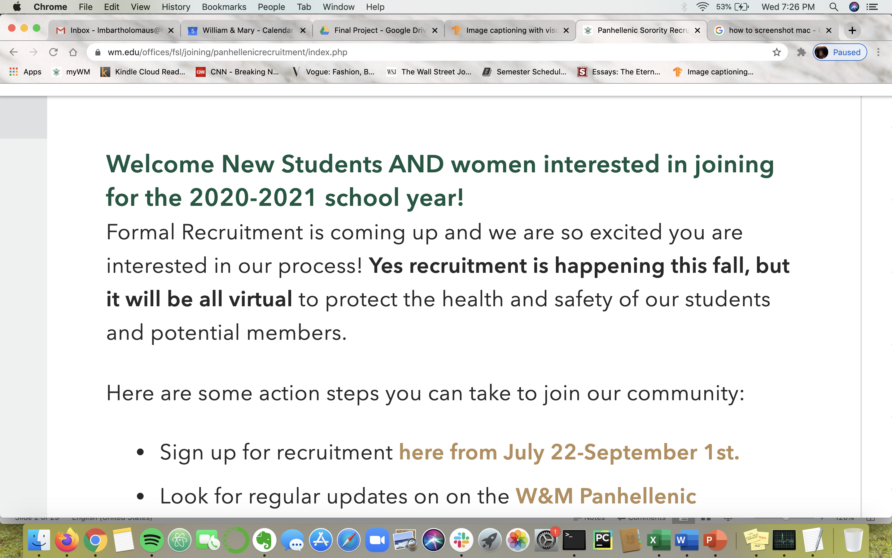

# Using an Attention Based Model to Comparatively Assess Instagram Accounts

# Problem Statement
Panhellenic recruitment has been made completely virtual for this upcoming semester, putting serious constraints on the ability to recruit new pledge classes in a holistic manner. A big part of sorority recruitment is finding a place where you “fit in” or “feel at home” and it’s impossible to determine if you feel like you fit in with a group of girls through video chats, and vice versa. Since William and Mary Panhellenic recruitment seemingly “has” to happen this fall, sororities will have to utilize as much data about potential new members in order to make informed decisions. Social media, although criticized for being contrived, could pose a potential solution, allowing for sororities to learn more about potential new members and to construct an organic recruiting process in general.

# Data

# Model

